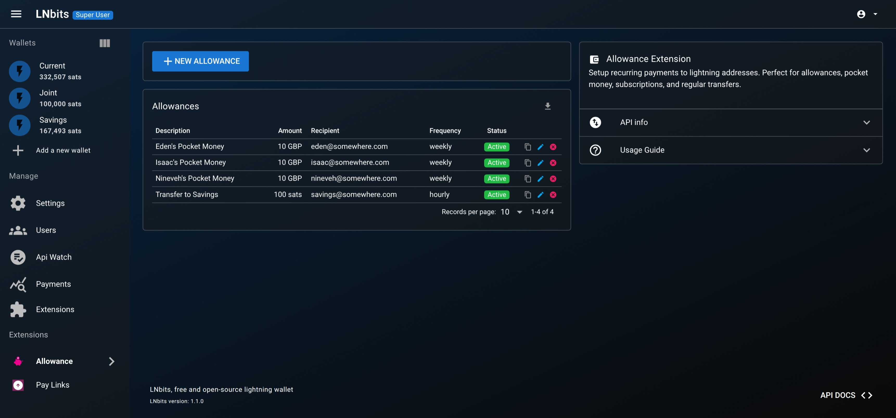
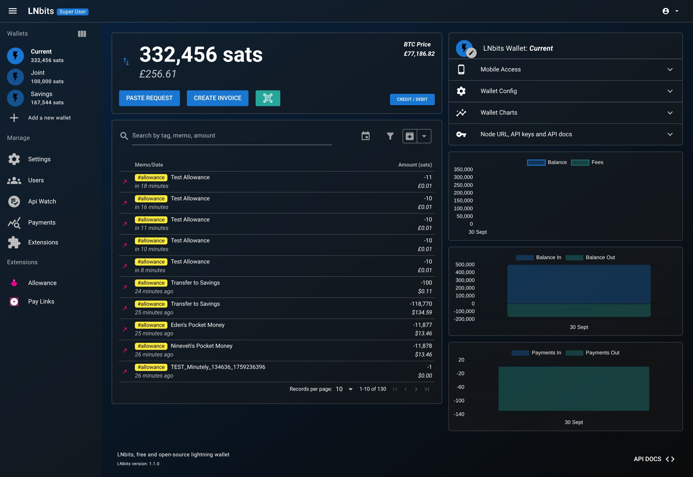
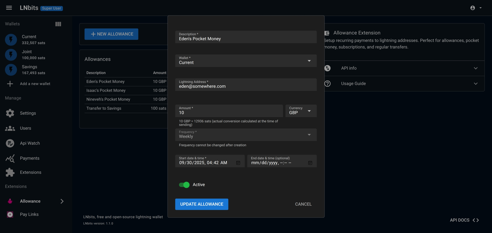

# Allowance - An [LNbits](https://github.com/lnbits/lnbits) Extension


> **Note**: This extension was developed as a test of using Claude Code to build an LNBits extension, demonstrating AI-assisted development of Bitcoin Lightning applications.

## Introduction

This is an LNBits extension that allows you to setup recurring payments from your LNBits wallet to any Lightning address or LNURL-pay endpoint. Perfect for allowances, pocket money, subscriptions, and regular transfers. This enables scheduled payments to external services and Lightning addresses, not just wallet-to-wallet transfers within the same LNBits instance.

### Screenshots

| Allowance Management | Transaction History | Edit Allowance |
|:---:|:---:|:---:|
|  |  |  |

### Installation

Install and enable the "Allowance" extension either through the official LNbits manifest (**not yet vetted**) or by adding https://raw.githubusercontent.com/BenGWeeks/allowance/main/extensions.json to `Server` / `Extension Sources`.

### Development

For development, we use Docker Compose to run LNBits:

1. Clone this repository
2. Start LNBits using Docker Compose:
   ```bash
   docker-compose up -d
   ```
3. Access the development instance at `http://localhost:5002`
4. Enable the Allowance extension through the Extensions menu

The Docker Compose configuration automatically mounts the current directory into the container, so changes to the code are reflected immediately.

> Note: LNBits cannot be installed on Windows.

### Features

- ⚡ **Recurring Payments to Lightning Addresses**: Set up automated payments to any Lightning address or LNURL-pay endpoint
- 📅 **Flexible Payment Schedules**: Choose from minutely, hourly, daily, weekly, monthly, or yearly payment frequencies
- 💱 **Multi-Currency Support**: Pay in Bitcoin (sats) or fiat currencies (USD, EUR, GBP, etc.) with automatic conversion at payment time
- 🎯 **Decimal Precision**: Support for precise amounts like 0.02 GBP or 0.30 USD for small regular payments
- 📊 **Payment History Tracking**: All payments appear in your LNBits wallet history with clear allowance names
- ⏰ **Automatic Start and End Dates**: Schedule when payments should begin and end, with automatic deactivation when expired
- 🎛️ **Easy Management**: Create, edit, activate/deactivate, and delete allowances through a simple interface

### Testing

The extension includes comprehensive test suites for both API and UI testing. For detailed testing procedures, see **[Testing Guide](docs/testing.adoc)**.

**Quick start:**
```bash
# Run all tests
./tests/run_all_tests.sh

# Run API tests only
./tests/run_api_tests.sh

# Run UI tests only
./tests/run_ui_crud_tests.sh
```

**Note**: Create `.env.local` with test credentials before running tests. See [Testing Guide](docs/testing.adoc) for complete setup instructions.

### Documentation

Comprehensive documentation is available in the `docs/` directory:

- **[Installation Guide](docs/installation.adoc)** - Step-by-step installation instructions
- **[FAQs](docs/faqs.adoc)** - Frequently asked questions and answers
- **[Testing Guide](docs/testing.adoc)** - Detailed testing procedures
- **[Troubleshooting Guide](docs/troubleshooting.adoc)** - Common issues and solutions

### Code Quality

Before committing, run code formatting and linting:

```bash
# Format Python files (REQUIRED for CI)
black .

# Run type checking
mypy --ignore-missing-imports *.py

# Run linting
ruff check .
```

**Important**: CI will fail if code is not formatted with Black.

### Repository Structure

```
allowance/
├── .github/workflows/       # CI/CD pipeline configuration
│   └── integration-tests.yml # GitHub Actions workflow
├── docs/                    # Documentation (AsciiDoc format)
│   ├── installation.adoc   # Installation guide
│   ├── faqs.adoc           # Frequently asked questions
│   ├── testing.adoc        # Testing procedures
│   └── troubleshooting.adoc # Problem resolution
├── tests/                   # Comprehensive test suite
│   ├── api/                # API endpoint tests (Python)
│   │   ├── check-*.py      # Validation tests
│   │   ├── create-*.py     # Creation tests
│   │   ├── read-*.py       # Read operation tests
│   │   ├── update-*.py     # Update operation tests
│   │   └── delete-*.py     # Deletion tests
│   ├── ui/                 # UI automation tests (Playwright)
│   │   ├── setup/          # Setup and configuration tests
│   │   ├── crud/           # CRUD operation tests
│   │   ├── auth-helper.js  # Centralized authentication
│   │   └── helpers.js      # Shared test utilities
│   ├── run_all_tests.sh    # Run all tests
│   ├── run_api_tests.sh    # Run API tests only
│   └── run_ui_crud_tests.sh # Run UI tests only
├── static/
│   └── js/                 # Frontend JavaScript
│       └── allowance.js    # Vue.js application
├── templates/allowance/    # HTML templates
│   └── index.html         # Main extension page
├── __init__.py            # Extension initialization
├── config.json            # Extension configuration
├── crud.py                # Database operations
├── models.py              # Pydantic data models
├── tasks.py               # Background task processing
├── views.py               # Frontend routes
├── views_api.py           # API endpoints
├── migrations.py          # Database schema
├── manifest.json          # Extension manifest
├── extensions.json        # Extension source manifest
├── README.md              # This file
└── CLAUDE.md              # Development notes
```


### Recurrence timing

Schedules keep the UTC time and original day from `start_datetime`. Monthly dates
clamp in shorter months (January 31 → February 28/29 → March 31); yearly February
29 schedules return to February 29 in leap years. Local display times can change
with daylight saving time. The worker polls every 60 seconds, so execution may be
late, but that delay no longer shifts future occurrences.

After downtime or reactivation, an overdue allowance gets one attempt; missed
periods are skipped. Failed attempts also advance to the next scheduled period,
as before. Editing metadata does not reset the schedule. Existing drifted dates
are realigned after the next due attempt; this change does not replay old payments.

### LNbits compatibility

The Python extension targets LNbits 1.6.x (tested on 1.6.0 and the official
1.6.1 Docker image), with Python 3.10–3.12. It uses LNbits' task manager, wallet
authentication wrapper, and configured fiat-rate providers. The 1.6.1 release
retains internal `1.6.1-rc2` metadata, so the declared minimum is 1.6.0.

This remains a native Python extension, not a sandboxed WASM component. Porting
to WASM requires replacing direct database, HTTP and payment-service access with
permission-scoped host APIs and a migration strategy for existing allowances.

### Automated pull-request checks

`Allowance checks` runs on every PR, main/develop push, manual invocation, and
weekly. It discovers real unit tests and fails if none are found. Tests run in
the official LNbits 1.6.0, 1.6.1, and latest stable release images (deduplicated),
with networking disabled, a read-only checkout, and disposable SQLite data.
Payment/HTTP interactions are mocked; these checks cannot send real payments.
The suite covers calendar recurrence, worker timing, authorization, wallet/task
integration, and database persistence. Formatting and lint errors fail CI.

Run the same suite locally:

```bash
docker run --rm --network none \
  -e LNBITS_DATA_FOLDER=/tmp/allowance-tests \
  -e LOGURU_LEVEL=ERROR \
  -v "$PWD:/app/lnbits/extensions/allowance:ro" \
  lnbits/lnbits:v1.6.1 /app/.venv/bin/python \
  /app/lnbits/extensions/allowance/tests/run_unit_tests.py
```

The historical network/API/browser scripts remain available for manual dev
testing. CI does not claim browser or PostgreSQL coverage. Configure the
`quality` and `Regression (...)` jobs as required branch-protection checks.
