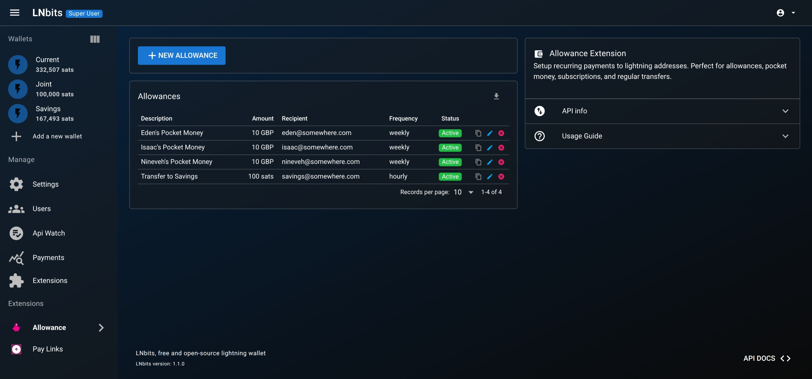
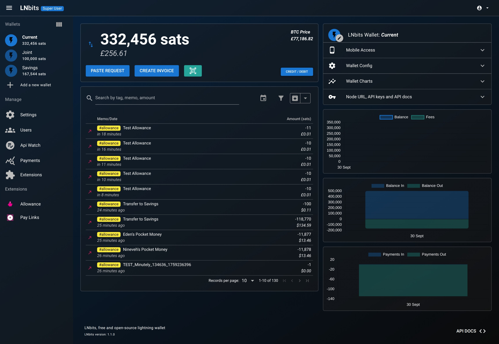
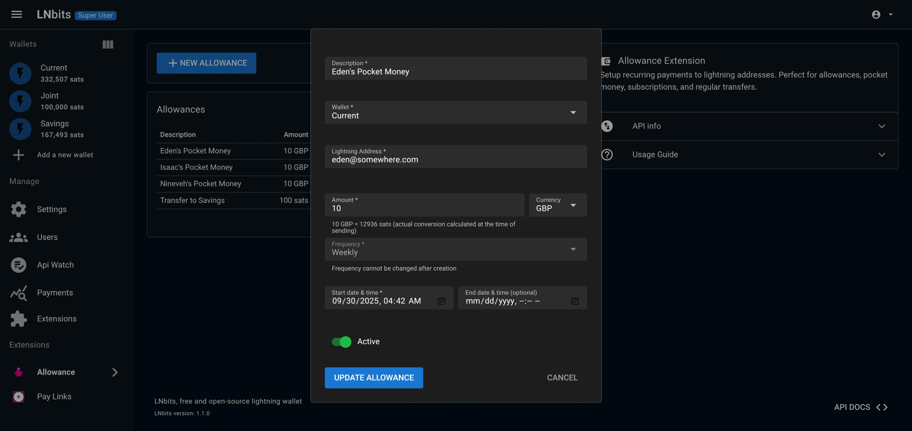

# Allowance - An [LNbits](https://github.com/lnbits/lnbits) Extension

[](https://coderabbit.ai)


> **Note**: This extension was developed as a test of using Claude Code to build an LNBits extension, demonstrating AI-assisted development of Bitcoin Lightning applications.

## Introduction

This is an LNBits extension that allows you to setup recurring payments from your LNBits wallet to any Lightning address or LNURL-pay endpoint. Perfect for allowances, pocket money, subscriptions, and regular transfers. This enables scheduled payments to external services and Lightning addresses, not just wallet-to-wallet transfers within the same LNBits instance.

### Screenshots

| Allowance Management | Transaction History | Edit Allowance |
|:---:|:---:|:---:|
|  |  |  |

### Installation

Install and enable the "Allowance" extension either through the official LNbits manifest (**not yet vetted**) or by adding https://raw.githubusercontent.com/BenGWeeks/allowance/main/extensions.json to `Server` / `Extension Sources`.

### Development

For development, we use Docker Compose to run LNBits:

1. Clone this repository
2. Start LNBits using Docker Compose:
   ```bash
   docker-compose up -d
   ```
3. Access the development instance at `http://localhost:5002`
4. Enable the Allowance extension through the Extensions menu

The Docker Compose configuration automatically mounts the current directory into the container, so changes to the code are reflected immediately.

> Note: LNBits cannot be installed on Windows.

### Features

- ⚡ **Recurring Payments to Lightning Addresses**: Set up automated payments to any Lightning address or LNURL-pay endpoint
- 📅 **Flexible Payment Schedules**: Choose from minutely, hourly, daily, weekly, monthly, or yearly payment frequencies
- 💱 **Multi-Currency Support**: Pay in Bitcoin (sats) or fiat currencies (USD, EUR, GBP, etc.) with automatic conversion at payment time
- 🎯 **Decimal Precision**: Support for precise amounts like 0.02 GBP or 0.30 USD for small regular payments
- 📊 **Payment History Tracking**: All payments appear in your LNBits wallet history with clear allowance names
- ⏰ **Automatic Start and End Dates**: Schedule when payments should begin and end, with automatic deactivation when expired
- 🎛️ **Easy Management**: Create, edit, activate/deactivate, and delete allowances through a simple interface

### Testing

The extension includes comprehensive test suites for both API and UI testing. For detailed testing procedures, see **[Testing Guide](docs/testing.adoc)**.

**Quick start:**
```bash
# Run all tests
./tests/run_all_tests.sh

# Run API tests only
./tests/run_api_tests.sh

# Run UI tests only
./tests/run_ui_crud_tests.sh
```

**Note**: Create `.env.local` with test credentials before running tests. See [Testing Guide](docs/testing.adoc) for complete setup instructions.

### Documentation

Comprehensive documentation is available in the `docs/` directory:

- **[Installation Guide](docs/installation.adoc)** - Step-by-step installation instructions
- **[FAQs](docs/faqs.adoc)** - Frequently asked questions and answers
- **[Testing Guide](docs/testing.adoc)** - Detailed testing procedures
- **[Troubleshooting Guide](docs/troubleshooting.adoc)** - Common issues and solutions

### Code Quality

Before committing, run code formatting and linting:

```bash
# Format Python files (REQUIRED for CI)
black .

# Run type checking
mypy --ignore-missing-imports *.py

# Run linting
ruff check .
```

**Important**: CI will fail if code is not formatted with Black.

### Repository Structure

```
allowance/
├── .github/workflows/       # CI/CD pipeline configuration
│   └── api-unit-tests.yml # GitHub Actions workflow
├── docs/                    # Documentation (AsciiDoc format)
│   ├── installation.adoc   # Installation guide
│   ├── faqs.adoc           # Frequently asked questions
│   ├── testing.adoc        # Testing procedures
│   └── troubleshooting.adoc # Problem resolution
├── tests/                   # Comprehensive test suite
│   ├── unit/               # Offline regression tests
│   ├── run_unit_tests.py   # Regression runner
│   ├── api/                # API endpoint tests (Python)
│   │   ├── check-*.py      # Validation tests
│   │   ├── create-*.py     # Creation tests
│   │   ├── read-*.py       # Read operation tests
│   │   ├── update-*.py     # Update operation tests
│   │   └── delete-*.py     # Deletion tests
│   ├── ui/                 # UI automation tests (Playwright)
│   │   ├── setup/          # Setup and configuration tests
│   │   ├── crud/           # CRUD operation tests
│   │   ├── auth-helper.js  # Centralized authentication
│   │   └── helpers.js      # Shared test utilities
│   ├── run_all_tests.sh    # Run all tests
│   ├── run_api_tests.sh    # Run API tests only
│   └── run_ui_crud_tests.sh # Run UI tests only
├── static/
│   └── js/                 # Frontend JavaScript
│       └── allowance.js    # Vue.js application
├── templates/allowance/    # HTML templates
│   └── index.html         # Main extension page
├── __init__.py            # Extension initialization
├── config.json            # Extension configuration
├── crud.py                # Database operations
├── models.py              # Pydantic data models
├── tasks.py               # Background task processing
├── views.py               # Frontend routes
├── views_api.py           # API endpoints
├── migrations.py          # Database schema
├── manifest.json          # Extension manifest
├── extensions.json        # Extension source manifest
├── README.md              # This file
└── CLAUDE.md              # Development notes
```


### Recurrence timing

New schedules retain the browser's IANA timezone. Daily, weekly, monthly and yearly
payments follow that local calendar; hourly and minutely intervals use elapsed time.
Monthly dates clamp in shorter months (January 31 → February 28/29 → March 31).
At a spring DST gap the payment moves forward by the gap; an autumn repeated time
occurs once, at its first occurrence. Existing schedules retain UTC on upgrade.
The worker polls every 60 seconds; polling delay does not shift the schedule.

After downtime or reactivation, an overdue allowance gets one attempt; older missed
periods are skipped. Confirmed unsent attempts retry after 1, 2, 4, 8, 16, 32 and
then 60 minutes, until the next occurrence or 24 hours after the first failure,
whichever comes first. Confirmed terminal outgoing failures advance the schedule.
Unknown outcomes retain their invoice identity and never request another invoice.
When a retry window expires, the following occurrence keeps its own payment attempt.
Editing an allowance resets its unsent retry backoff without releasing a pending claim.
Paused or expired claims are still checked for settlement without sending payments.

Only the invocation that called LNbits may release a claim after an exception,
and only after a global payment lookup confirms there is no outgoing record.
Claims left by cancellation, a crash or a database lookup failure require operator
investigation. Age alone cannot prove that a suspended sender will not resume.
Stop the extension and verify the invoice hash against LNbits and the funding
source before repairing such a claim; never clear it merely to retry a payment.

The scheduler polls independently of payment completion, with one in-flight
worker per wallet and up to eight overall. Each worker takes at most five rows;
wallets and rows rotate between turns so a backlog cannot monopolize scheduling.
Free slots are refilled immediately; unchanged pending rows are checked at most
once a minute. New due work is fetched at least once per minute.
Claimed payments have no extension-imposed cancelling timeout. New creation is limited to 100 allowances per wallet;
existing records are retained. Invalid stored rows are logged and skipped so they
cannot stop other users' payments. Operators must repair those rows separately.
The manual `/trigger` endpoint and unused public template routes have been removed.

### LNbits compatibility

The Python extension targets LNbits 1.6.x (tested on 1.6.0 and the official
1.6.1 Docker image), with Python 3.10–3.12. It uses LNbits' task manager, wallet
authentication wrapper, and configured fiat-rate providers. The 1.6.1 release
retains internal `1.6.1-rc2` metadata, so the declared minimum is 1.6.0.

This remains a native Python extension, not a sandboxed WASM component. Porting
to WASM requires replacing direct database, HTTP and payment-service access with
permission-scoped host APIs and a migration strategy for existing allowances.

### Automated pull-request checks

`Allowance checks` runs on every PR, main/develop push, manual invocation, and
weekly. It discovers real unit tests and fails if none are found. Tests run in
the official LNbits 1.6.0, 1.6.1, and latest stable release images (deduplicated),
with networking disabled, a read-only checkout, and disposable SQLite data.
Payment/HTTP interactions are mocked; these checks cannot send real payments.
The suite covers calendar recurrence, worker timing, authorization, wallet/task
integration, and database persistence. Formatting and lint errors fail CI.

Run the same suite locally:

```bash
docker run --rm --network none \
  -e LNBITS_DATA_FOLDER=/tmp/allowance-tests \
  -e LOGURU_LEVEL=ERROR \
  -v "$PWD:/app/lnbits/extensions/allowance:ro" \
  lnbits/lnbits:v1.6.1 /app/.venv/bin/python \
  /app/lnbits/extensions/allowance/tests/run_unit_tests.py
```

The historical network/API/browser scripts remain available for manual dev
testing. CI covers SQLite and PostgreSQL; browser tests run explicitly on dev. Configure the
`Allowance checks passed` as the required branch-protection check. It aggregates
all matrix, PostgreSQL and quality jobs under a stable name.

The obsolete automatic Claude-review workflow was removed because its configured
model is unavailable. CodeRabbit reviews require enabling the GitHub App for this
repository; comments requesting a review alone do not install the app.

`.coderabbit.yaml` enables review of stacked PRs targeting `fix/*` or `ci/*`,
as well as the default branch and `develop`, once the app has repository access.

### Dev browser verification

The Playwright lifecycle test creates an **inactive** monthly allowance, edits its
name, amount and memo, reloads to verify persistence and unchanged schedule dates,
then deletes it through the UI. API assertions confirm each result; cleanup only
removes the record created by that run. It does not test Lightning settlement.

Set `TEST_LNBITS_URL`, `LNBITS_ADMIN_USERNAME`, `LNBITS_ADMIN_PASSWORD` and
`RECEIVING_WALLET_NAME`, `PAYLINK_EMAIL`, `ALLOWANCE_TEST_CREATE_AMOUNT` and `ALLOWANCE_TEST_EDIT_AMOUNT`
(positive integer sats) in the ignored root `.env.local` or environment. Use an initialized
dev instance with Allowance enabled and a wallet. Use a test recipient ending in
`.invalid` for this inactive CRUD test.

```bash
cd tests
npm ci
npx playwright install chromium
# Set this explicitly to the same dev URL as TEST_LNBITS_URL:
export ALLOWANCE_UI_TEST_CONFIRM="$(node -p 'require("./ui/auth-helper").getConfig().baseUrl')"
npx playwright test --project=chromium
```

Screenshots and the HTML report are stored locally in ignored test output folders.
Do not publish artifacts containing account information. Browser tests are run
explicitly against dev; CI runs offline unit/SQLite regressions plus PostgreSQL
regressions in disposable containers (`bash tests/run_postgres_tests.sh`).

### Unresolved payments

A **Pending** badge means an invoice has been claimed but its final outcome is
not yet known. Use **Check payment status** to query LNbits without sending a new
payment. This also works while the allowance is paused. Once a terminal status is
confirmed, the schedule advances from its original anchor, skipping missed periods.
An explicit LNbits payment rejection is terminal; timeouts and unknown errors are not.

If LNbits has no payment record (for example after a crash during submission), the
claim stays protected. The server operator must verify the funding-source payment
before changing that claim. Clearing the error message does not release it. Pausing
prevents new claims but cannot cancel a payment already submitted to Lightning.

### LNURL network policy

Lightning-address discovery and invoice callbacks use public HTTPS endpoints on
port 443 with IPv4 connectivity. IPv6-only endpoints are unsupported; IPv4-only
egress prevents host-specific NAT64 translation from bypassing address checks. Private, loopback, link-local, multicast and translated IP destinations,
credentials in URLs, and redirects are rejected. DNS results are validated at
connection time and the connection is pinned to the validated IP while preserving
TLS hostname verification. Requests have a ten-second total deadline and a 256 KiB
response limit. Onion LNURL services are unsupported.
Returned invoices must contain exactly the requested millisatoshi amount.

For split DNS, the server operator can explicitly trust exact hostname/private IPv4
pairs using the container environment variable `ALLOWANCE_TRUSTED_LNURL_DESTINATIONS`:

```yaml
environment:
  ALLOWANCE_TRUSTED_LNURL_DESTINATIONS: '{"payments.example.com":["192.168.1.89"]}'
```

Recreate the container after changing its environment. This setting is unavailable
through the allowance API. Only list services you control and trust: allowances can
request HTTPS paths on those services. Wildcards, CIDR ranges, loopback, link-local,
IPv6, HTTP, other ports and redirects remain unsupported. Only RFC1918 IPv4 addresses
are accepted in this policy; malformed configuration rejects requests. Each DNS
answer must be public or explicitly approved for that exact hostname. Connections
remain pinned to checked addresses, with normal certificate and hostname validation.
Invoice callbacks are checked independently; a different private callback hostname
needs its own explicit entry. Never add a broad internal network exception.

Before release, resolve every existing recipient from inside the target container
and perform read-only LNURL metadata discovery using the candidate policy. Do not
request invoices or send payments as part of this preflight. On isolated dev, test
an actual scheduled FakeWallet payment and a realistic split-DNS HTTPS endpoint,
then verify history and the next scheduled date. Passing UI and heartbeat checks
alone does not demonstrate payment delivery.


### Operational monitoring

The allowance screen shows **Last Success**, the latest 50 completed attempts in
**Payment history**, and warnings for overdue payments, unresolved claims or a
stale scheduler. History starts when this update is installed; earlier payments
remain in LNbits wallet history. Deleting an allowance also deletes its extension
history. The history API supports `limit` (1–100) and `offset` for older entries.

Payment history also shows the current error, automatic retry time and a diagnostic
log of failures, retry scheduling and completion. It displays the latest 50 log
entries and retains up to 200 per allowance. Older errors cannot be reconstructed.
`GET /allowance/api/v1/allowance/{id}/logs` uses the owning wallet's invoice key
and supports `limit` (1–100) and `offset`. Logs contain fixed diagnostic messages,
not raw exception text, invoices or wallet credentials. Deleting the allowance
removes its logs. **Check payment status** is enabled only when an invoice is
pending; it does not retry a payment. Use **Refresh history** for updated diagnostics
or **Edit allowance** to correct the destination.

`GET /allowance/api/v1/health` accepts a wallet invoice key and reports only that
wallet's overdue/pending counts, plus scheduler health. A heartbeat older than
three minutes is unhealthy. Poll externally to detect an extension that is disabled
or fails to load, because a disabled extension cannot report its own health.

Run `python3 scripts/check_allowance_health.py` from your uptime monitor or cron
with `ALLOWANCE_URL` (the LNbits base URL) and `ALLOWANCE_INVOICE_KEY` supplied through
a protected environment file. Use one check per wallet that has allowances.
Exit code 0 means healthy; 2 means attention is required, including 404, authentication
failure, stale heartbeat or an unreachable server. Configure your monitor to alert
on nonzero exits. The script performs no writes or payments and never prints the key.
HTTPS is required except for loopback development URLs; redirects are rejected.

### Retrying a specific payment

Open **Payment history** for a compact list of scheduled payments. Choose
**Details** to see one payment’s retained attempts, failure reason and next action. Status distinguishes **Retry scheduled**,
**Retry queued**, **Awaiting payment confirmation**, **Paid**, and ended retries.
**Check payment status** only reconciles an existing claim; it never resends.

**Retry this payment** requires an explicit confirmation showing the amount,
currency, recipient and original scheduled time. Fiat conversions use the rate at
retry time. The request queues one eligible occurrence for the worker; it does not
send synchronously. Duplicate requests and stale confirmations are rejected.

A current confirmed-unsent failure can be brought forward within its existing retry
window. An older failed occurrence can be retried only when it was never submitted,
its saved payment details still match, the allowance is active, and no current
payment is due or unresolved. Older records without saved details cannot be retried
through this action. Paid, skipped and uncertain payments are never eligible.

An older retry temporarily occupies the worker's current occurrence while retaining
the regular next-payment date. Completion restores that date, or skips elapsed
periods to the next anchored date. It never queues other missed payments. Its retry
window ends at the earlier of 24 hours or the regular next-payment date. Pause/resume
remains available, but payment details cannot change while an older retry is active.
A payment already submitted cannot be cancelled by pausing.

The owning wallet's admin key is required for
`POST /allowance/api/v1/allowance/{id}/retry` with `scheduled_at` (epoch seconds),
`revision`, and `confirmed: true`. Success returns 202; changed or ineligible state
returns 409. The wallet-scoped `/occurrences` endpoint provides eligibility reasons,
saved details and retained diagnostic events. Migration m009 adds saved details for
new outcomes; it does not invent snapshots for legacy history.

### Upgrading to 1.1.1

Version 1.1.1 fixes the migration import error when upgrading from 1.0.6 through
LNbits. Do not choose 1.1.0 for a UI upgrade.

Deactivate Allowance before installing the update, then restart LNbits immediately
after installation and check activation and scheduler health. LNbits can retain
old Python modules in memory even after reporting a successful installation;
the restart loads the candidate runtime and completes any deferred migrations.

If you already attempted 1.1.0 and installation failed, ask the server operator
to restore the previous extension files and restart LNbits before trying 1.1.1.
The failed attempt can leave broken migrations cached and remove the extension
files. Do not delete the extension database, reset its migration version, or clear
pending payment hashes. Back up the databases before recovery or upgrading.

### Preparing releases

See the [release guide](docs/releasing.md) for archive validation, draft releases,
restart-based upgrade checks and submitting to the LNbits extension registry.


### Paying a skipped occurrence

A skipped occurrence was deliberately passed over, such as when an operator resumes
an interrupted schedule without catching up. A blocked or unsuccessful payment is
a failure; it can subsequently be skipped during recovery. Skipping sends no funds.

In Payment history, open Details for a skipped occurrence and choose **Pay this
skipped occurrence**. Confirm the saved recipient and amount. The worker queues
that one payment, records the request and result against the original occurrence,
and preserves the regular schedule. Fiat amounts use the rate at payment time.
Failed entries continue to show **Retry this payment**.

Both actions require unchanged saved payment details, no submitted or uncertain
payment, and an active allowance with no other due payment or older retry in
progress. Older entries without saved details cannot be paid through this action.
Payments made separately through the LNbits wallet are not linked automatically;
check wallet history before confirming if you may already have paid manually.
